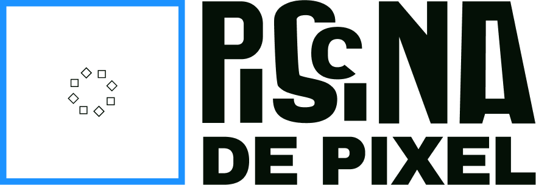

 

O logo da piscina de pixel foi desenvolvido a partir de um sistema generativo usando javascript. 👾
O sistema generativo recebe alguns parâmetros que eu defini para a identidade da piscina e toma algumas decisões. E é aí que as coisas saem do controle e ficam interessantes. 

A regra principal do sistema, construído a partir da nossa identidade visual, é o quadrado. Que representa tanto uma piscina (imersão, interação e diversão mesmo) quanto um pixel, que é a menor unidade de uma imagem digital, a mídia principal do estúdio. 
O quadrado traz também o peso de uma forma geométrica básica que pode gerar outras a partir de variações e experimentações. ▪️

  

